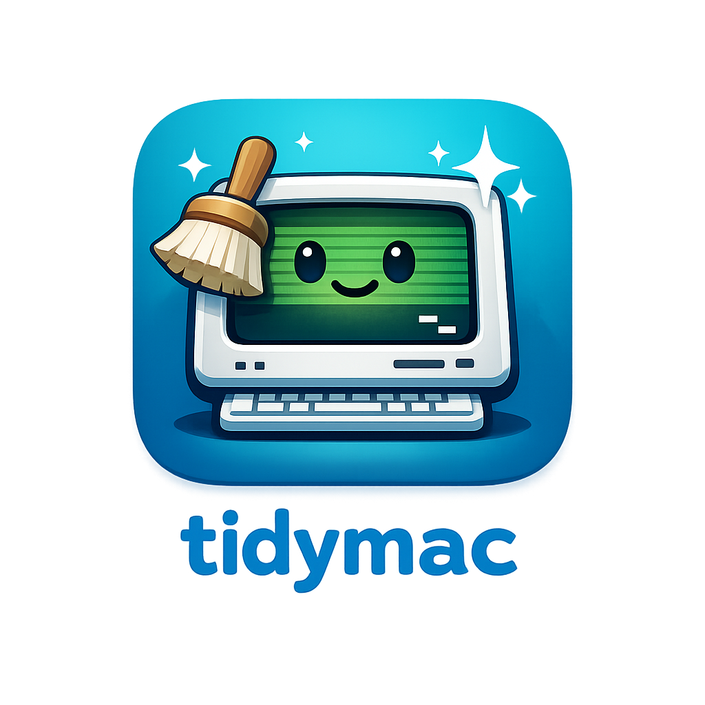

<p align="center">
  
</p>

<h1 align="center">tidymac</h1>

<p align="center">A lightweight TUI system cleaner for macOS, written in Rust.</p>

<p align="center">Clean caches, dev tool artifacts, manage apps, monitor system resources, and kill rogue ports — all from your terminal.</p>

<p align="center">
  
  
  
</p>

## Features

- **System Monitor** — CPU graph with per-core usage, memory breakdown, disk usage, all updating in real-time
- **Listening Ports** — See what's running on localhost, memory usage per process, kill ports with confirmation
- **System Junk Scanner** — Find and clean caches, logs, and Homebrew leftovers
- **Dev Tools Cleaner** — Scan Xcode DerivedData, Docker, `node_modules`, and Cargo `target/` directories
- **App Manager** — List installed apps sorted by size, uninstall apps + related files, find orphaned Application Support files
- **Async Scanning** — All scans run in background threads with animated spinners, UI never freezes
- **Safe Mode** — Preview-only mode enabled by default, nothing gets deleted until you turn it off
- **btop-inspired UI** — Rounded borders, muted color palette, dense information layout

## Installation

### Homebrew (recommended)

```bash
brew install therealmazin/tidymac/tidymac
```

### npx (no install needed)

```bash
npx tidymac
```

### npm (global install)

```bash
npm install -g tidymac
```

### From source

```bash
git clone https://github.com/therealmazin/tidymac.git
cd tidymac
cargo build --release
```

The binary will be at `target/release/tidymac`.

## Usage

### Navigation

| Key | Action |
|-----|--------|
| `Tab` | Switch focus between sidebar and main panel |
| `j` / `k` | Navigate up/down in lists |
| `Esc` | Return focus to sidebar |
| `q` / `Ctrl+C` | Quit |

### Home Screen

| Key | Action |
|-----|--------|
| `x` | Kill selected port's process (with confirmation) |

### Scan / Dev Screens

| Key | Action |
|-----|--------|
| `s` | Start scan |
| `Space` | Toggle item selection |
| `c` | Clean selected items (moves to Trash) |

### Apps Screen

| Key | Action |
|-----|--------|
| `s` | Scan installed applications |
| `o` | Scan for orphaned files |
| `d` | Uninstall selected app (with confirmation) |

### Config Screen

| Key | Action |
|-----|--------|
| `Space` | Toggle Safe Mode on/off |

## How it works

tidymac scans common macOS locations for files that can be safely removed:

- **Caches**: `~/Library/Caches`, `/Library/Caches`
- **Logs**: `~/Library/Logs`, `/var/log`
- **Homebrew**: old formula versions, download caches
- **Xcode**: DerivedData, Archives, iOS Device Support, Simulators
- **Docker**: container data in `~/Library/Containers/com.docker.docker`
- **Node.js**: `node_modules` directories in your project folders
- **Cargo**: `~/.cargo/registry` and `target/` directories

All deletions go to macOS Trash (via the `trash` crate), so you can recover anything.

## Tech Stack

- [Rust](https://www.rust-lang.org/) — safe, fast systems language
- [ratatui](https://ratatui.rs/) — terminal UI framework
- [crossterm](https://github.com/crossterm-rs/crossterm) — cross-platform terminal manipulation
- [sysinfo](https://github.com/GuillaumeGomez/sysinfo) — system information (CPU, memory, disks, processes)
- [walkdir](https://github.com/BurntSushi/walkdir) — recursive directory traversal
- [trash](https://github.com/Byron/trash-rs) — safe file deletion via OS trash

## Requirements

- macOS (tested on Ventura and Sonoma)
- Rust 1.85+ (2024 edition)
- A terminal with Unicode support (iTerm2, Ghostty, Kitty, etc.)
- Nerd Font recommended for icons

## Contributing

Contributions are welcome! Feel free to open issues or submit pull requests.

```bash
# Run in development
cargo run

# Run tests
cargo test

# Build release
cargo build --release
```

## License

[MIT](LICENSE)
